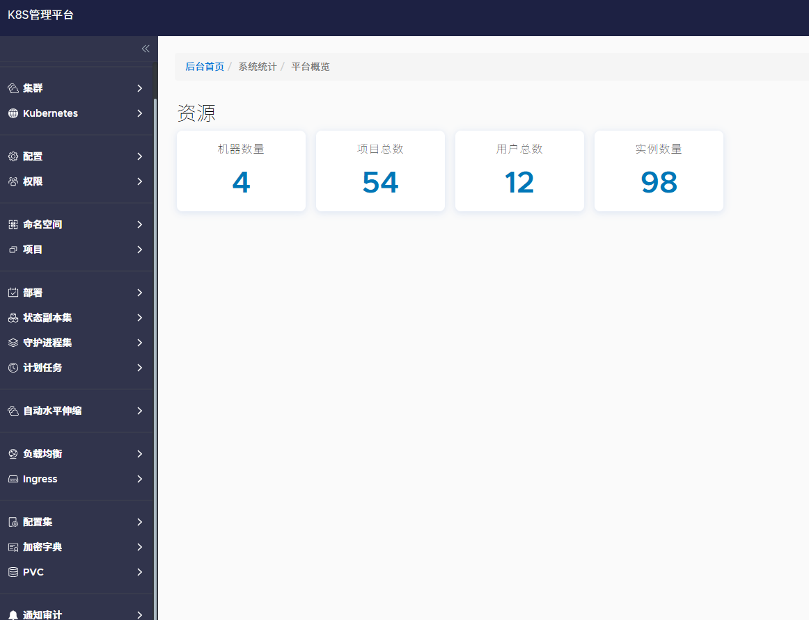
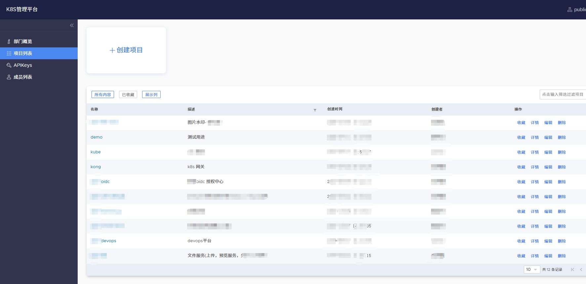
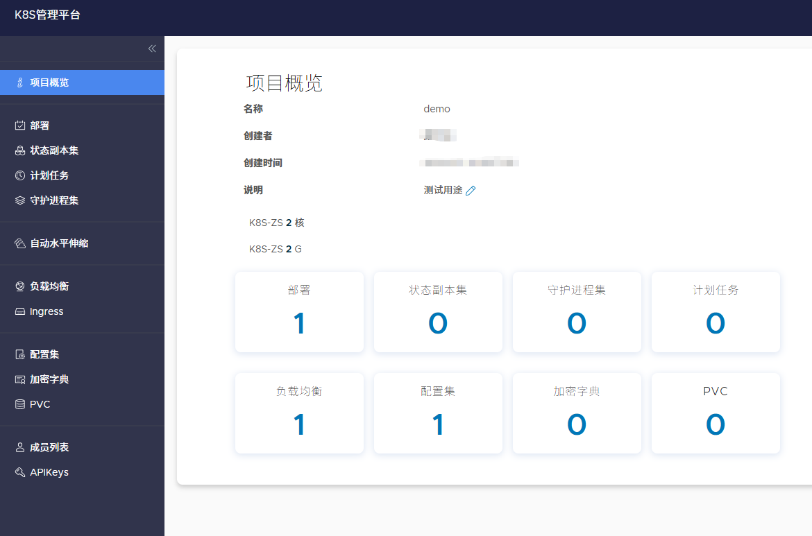
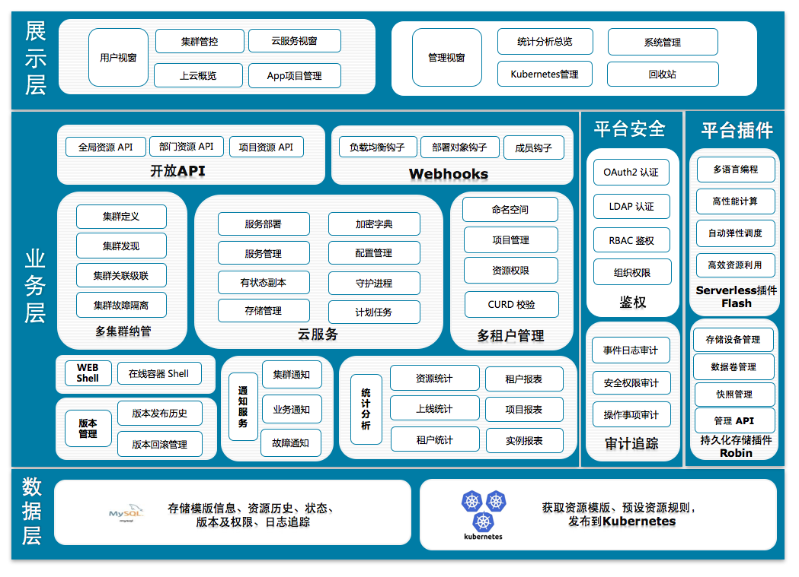

# Wayne

Wayne 是基于 [Qihoo360/wayne](https://github.com/Qihoo360/wayne) 维护升级的 Kubernetes 管理平台后端项目。原开源版本最高支持 Kubernetes v1.13.3，本项目对核心代码、依赖和资源接口进行了整理升级，当前 Kubernetes 相关依赖版本为 `v0.19.16`。 本项目已在生产环境中使用，且稳定运行 超过5年

## 项目特性

- 升级并适配 Kubernetes v1.19.16 相关 API。
- 保留应用、命名空间、集群、权限、发布状态和 Kubernetes 资源管理等核心能力。
- 支持 Deployment、StatefulSet、DaemonSet、Service、Ingress、ConfigMap、Secret、PVC、HPA、CronJob、Pod、Node、PV、CRD 等资源操作。
- 精简部分与 Kubernetes 管理无关的历史模块。
- 提供 OpenAPI/Swagger 文档和 Swagger UI 静态资源。

## 系统截图

### 平台概览



### 项目列表



### 项目概览



### Architecture



## 技术栈

- Go 1.20
- Beego v2
- MySQL
- Kubernetes client-go v0.19.16
- JWT RSA 签名认证
- go-swagger

## 目录说明

```text
.
├── clear/              # 历史资源清理、升级辅助代码和 GORM Gen 生成代码
├── conf/               # 应用配置、RSA 私钥和公钥
├── db/                 # 数据库初始化脚本
├── docs/               # 补充文档和 Kubernetes 示例 YAML
├── internal/api/       # 业务 API 实现，支持devops 平台对接打通自动部署. 具体接口请参考 api/openapi 接口
├── internal/k8s/       # Kubernetes Client、DTO 和资源封装
├── internal/model/     # 数据模型
├── internal/router/    # Beego 路由注册
├── pkg/                # 通用工具包
├── swagger/            # Swagger/OpenAPI 文档和 UI 静态资源
└── main.go             # 程序入口
```

## 快速开始

### 1. 准备环境

请先安装：

- Go 1.20+
- MySQL 5.7+/8.0+
- 可访问的 Kubernetes 集群
- `kubectl`，用于校验集群资源版本和调试

### 2. 初始化数据库

`db/wayne.sql` 只包含表结构，不会自动创建数据库。请先创建与 `conf/app.conf` 中 `DBName` 一致的数据库：

```sql
CREATE DATABASE `wayne-db` DEFAULT CHARACTER SET utf8mb4 COLLATE utf8mb4_general_ci;
```

然后导入表结构和管理员初始化数据：

```bash
mysql -u root -p wayne-db < db/wayne.sql
mysql -u root -p wayne-db < db/admin.sql
```

注意：`db/admin.sql` 中管理员密码字段为占位值，导入后请根据实际登录逻辑或密码生成规则更新管理员密码。

### 3. 修改配置

编辑 `conf/app.conf`，至少确认以下配置：

```ini
httpport = 8080
runmode = dev

DBName = "wayne-db"
DBTns = "tcp(127.0.0.1:3306)"
DBUser = "root"
DBPasswd = "your-password"
DBLoc = "Asia%2FShanghai"

RsaPrivateKey = "./conf/rsa-private.pem"
RsaPublicKey = "./conf/rsa-public.pem"
```

常用配置说明：

| 配置项 | 说明 |
| --- | --- |
| `httpport` | 服务监听端口，默认 `8080` |
| `runmode` | 运行模式，开发环境建议使用 `dev` |
| `EnableDBLogin` | 是否启用数据库登录 |
| `EnableApiKeys` | 是否启用 API Key |
| `TokenLifeTime` | JWT Token 有效期，单位秒 |
| `AppLabelKey` | 应用标签 Key，默认 `wayne-app` |
| `NamespaceLabelKey` | 命名空间标签 Key，默认 `wayne-ns` |
| `ShowSql` | 是否打印 SQL |

### 4. 生成 RSA 密钥

仓库中已有示例密钥。生产环境请重新生成，并保持路径与 `conf/app.conf` 中配置一致：

```bash
openssl genrsa -out conf/rsa-private.pem 1024
openssl rsa -in conf/rsa-private.pem -pubout -out conf/rsa-public.pem
```

### 5. 启动服务

```bash
go mod download
go run .
```

服务默认启动在：

```text
http://localhost:8080
```

开发模式下会暴露 Swagger UI：

```text
http://localhost:8080/swagger/
```

## API 说明

主要接口前缀：

- `/api/v1`：平台和 Kubernetes 管理接口
- `/openapi/v1`：OpenAPI 网关接口
- `/currentuser`、`/login/:type/?:name`、`/logout`：认证相关接口
- `/ws/pods/exec/*`：Pod WebShell 连接入口

认证接口返回 JWT 后，调用受保护接口时在请求头中携带：

```http
Authorization: Bearer <token>
```

也可参考：

- `swagger/swagger.json`
- `swagger/openapi.swagger.json`
- `docs/api.md`

## 生成 Swagger 文档

安装 go-swagger 后执行：

```bash
swagger generate spec -o ./swagger/swagger.json
```

接口注释示例：

```go
// swagger:route GET /api/v1/apps/statistics app reqAppStatisticsApp
// app count statistics
// responses:
//   200: respSuccessDescription
func (c *AppController) AppStatistics() {}

// swagger:parameters reqAppStatisticsApp
type reqAppStatisticsApp struct {
    // the namespaceid
    // in: path
    NamespaceId string `json:"namespaceid"`

    // is deleted, default false.
    // in: query
    Deleted bool `json:"deleted"`
}

// return ok success
// swagger:response
type respSuccessDescription struct {}
```

## Kubernetes 兼容性检查

可使用以下命令查看目标集群支持的 API 资源和版本：

```bash
kubectl api-resources -o wide
kubectl api-versions
```

本项目 Kubernetes 依赖锁定在 `v0.19.16`，升级集群或依赖时请重点检查 Ingress、HPA、CronJob、CRD 等资源的 API 版本差异。

## 测试

运行全部测试：

```bash
go test ./...
```

当前仓库的全量测试对本地环境有依赖，直接运行 `go test ./...` 可能遇到以下失败：

- `pkg/file-rotatelogs`：示例测试存在包导入循环。
- `clear`：测试会连接代码中配置的 MySQL 地址，需要本地可访问的测试数据库。
- `pkg/logger`：`TestPanic` 会触发 panic，当前测试未在断言中恢复。
- `tests`：Beego 测试初始化需要可定位到 `conf/app.conf`。

修复或准备上述依赖前，建议先针对具体包运行测试，例如：

```bash
go test ./pkg/des ./pkg/hack ./pkg/snaker
```

## 维护建议

- 不要在生产环境直接使用仓库中的示例 RSA 密钥和数据库密码。
- 数据库脚本导入前请确认目标库为空，避免 `DROP TABLE` 覆盖已有数据。
- 修改 Kubernetes 资源 API 时，同步更新 `internal/k8s`、`internal/api`、`internal/router` 和 Swagger 文档。
- `clear/` 目录主要用于历史资源升级和辅助生成，不建议作为运行时核心逻辑依赖。
